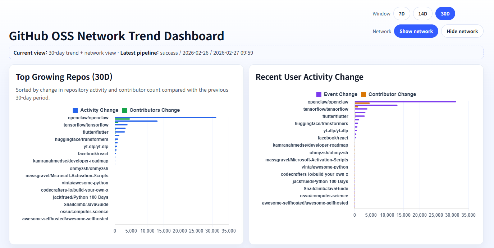
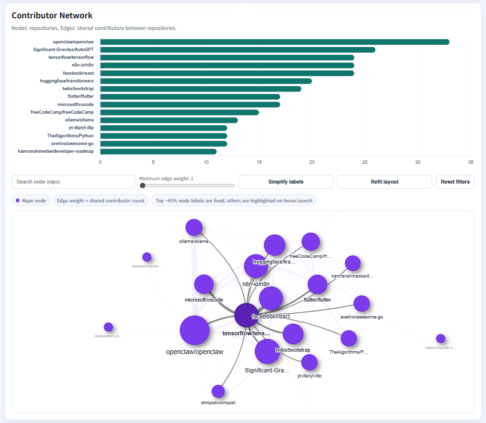

# GitHub OSS Network Trend

[English](./README.md) | [한국어](./README.ko.md)

GitHub 공개 이벤트를 기반으로 저장소 성장 추세(Trend)와 저장소 간 기여자 네트워크(Network)를 분석하는 엔드투엔드 분석 프로젝트입니다.

이 프로젝트는 GitHub Actions 기반 일일 배치 파이프라인으로 동작하며, BigQuery의 dbt로 이벤트 기반 집계를 수행하고 Cloud Run의 Flask 대시보드에서 인사이트를 제공합니다.

🔗 **라이브 데모:** https://oss-analytics-dashboard-415500942280.us-central1.run.app/  
🧩 **저장소:** https://github.com/hyeonseo2/github-oss-network-trend





## 빠른 링크

- 🚀 [라이브 대시보드](https://oss-analytics-dashboard-415500942280.us-central1.run.app/)
- 🧪 [DE Zoomcamp 프로젝트 문서](docs/de_zoomcamp_project_document.md)
- ☁️ [Cloud Run 배포 가이드](docs/cloud_run_deploy.md)

## 한눈에 보기

- **기본 뷰:** 30일 윈도우, 네트워크 ON
- **대시보드:** 2개 핵심 타일 (Trend, Network)
- **파이프라인:** GitHub Actions (일일) + dbt + BigQuery
- **배포:** Google Cloud Run

## 1. Overview

- Track repository momentum and contributor activity from public events (event-based metric, not raw GitHub star/fork API counts)
- Build trend models and contributor-network models in BigQuery
- Serve interactive Trend and Network views in a single dashboard

### Event-based metrics in this project

- **Activity Δ**: events in the current window minus events in the previous window
- **Contributor Δ**: unique contributors in the current window minus unique contributors in the previous window
- **Event Stars (window)**: event-based count for the selected window (display label only)
- **Active Contributors (window)**: unique contributors in the selected window (display label only)

## 2. Architecture

```text
GitHub Archive (public events)
        |
        v
GitHub Actions (daily batch)
        |
        v
GCS raw zone + BigQuery raw table (partitioned/clustered)
        |
        v
dbt (staging -> intermediate -> marts)
        |
        v
BigQuery marts
  - mart_repo_trend
  - mart_contributor_edges
  - mart_repo_popularity_snapshots
        |
        v
Flask dashboard on Cloud Run
```

## 3. Repository layout

```text
open-source-ecosystem-analytics-platform/
├── app/
│   ├── main.py
│   └── templates/index.html
├── dbt/
│   ├── macros/
│   ├── models/
│   │   ├── staging/
│   │   ├── intermediate/
│   │   ├── marts/
│   │   └── *.yml
│   ├── tests/
│   └── profiles.yml(.example)
├── docs/
│   └── cloud_run_deploy.md
├── terraform/
├── .github/workflows/
├── .env.example
├── requirements-web.txt
├── Makefile
└── README.md
```

## 4. Prerequisites

- Google Cloud project with BigQuery and Cloud Run enabled
- GitHub repository connected to GitHub Actions
- Terraform, `gcloud`, Python 3.10+, `make`
- `dbt-core` and `dbt-bigquery`

## 5. Quick start

### 5.1 Configure environment

```bash
cp .env.example .env
# fill variables, then export
source .env
```

### 5.2 Deploy infrastructure

```bash
cd terraform
terraform init
terraform plan
terraform apply
```

### 5.3 Run dbt locally (optional)

```bash
cd dbt
cp profiles.yml.example profiles.yml

dbt debug --profiles-dir . --target prod

dbt run --profiles-dir . --target prod \
  --vars '{"gcp_project_id":"'$GCP_PROJECT_ID'","raw_dataset":"oss_analytics_raw","raw_table":"raw_github_events","analysis_window_days":30,"network_window_days":30,"min_daily_events_for_trend":5}'

dbt test --profiles-dir . --target prod \
  --vars '{"gcp_project_id":"'$GCP_PROJECT_ID'","raw_dataset":"oss_analytics_raw","raw_table":"raw_github_events"}'
```

### 5.4 Run dashboard

```bash
# local
make run-dashboard

# cloud run

gcloud run deploy oss-analytics-dashboard \
  --source . \
  --region us-central1 \
  --platform managed \
  --allow-unauthenticated
```

## 6. Pipeline behavior (GitHub Actions)

Workflow: `.github/workflows/oss-batch-pipeline.yml`

1. Resolve target date (`workflow_dispatch` optional, defaults to previous day)
2. Authenticate to GCP (OIDC preferred, SA key fallback)
3. Ensure raw BigQuery table exists (partitioning/clustering)
4. Export events from `githubarchive` to GCS and load into BigQuery
5. Run `dbt run`
6. Run `dbt test`
7. Run quality SQL checks (null ratio / row-drop check)
8. Write execution metadata into `pipeline_runs`

## 7. Dashboard behavior

- Default filter values: **30-day window** and **network view shown**
- Trend tile is ordered by combined Activity/Contributor delta
- Network tile renders shared-contributor edges between repos
- Dashboard is read-only (no orchestration trigger from UI)

## 8. Operational notes

- Use `workflow_dispatch` inputs for backfill (`target_date`, `backfill_days`)
- `skip_quality_gate=1` can bypass quality checks for recovery tests (use with caution)
- Network model can be tuned by threshold variables (`network_window_days`, `min_shared_repo_count`)

## 9. Data model summary

- `stg_github_events`: normalized raw event staging
- `int_repo_daily_activity`: repository daily event totals
- `mart_repo_trend`: trend and change metrics
- `mart_contributor_edges`: weighted contributor-sharing edges
- `mart_repo_popularity_snapshots`: repository snapshot summary
- `pipeline_runs`: pipeline execution status for dashboard header

## 10. References

- [Cloud Run deployment guide](docs/cloud_run_deploy.md)
- [DE Zoomcamp project document](docs/de_zoomcamp_project_document.md)

## 11. Live Demo and Evidence

- **Live Dashboard:** https://oss-analytics-dashboard-415500942280.us-central1.run.app/
- **GitHub Repository:** https://github.com/hyeonseo2/github-oss-network-trend

### Screenshots

#### Trend View (default: 30 days, network on)


#### Network View


